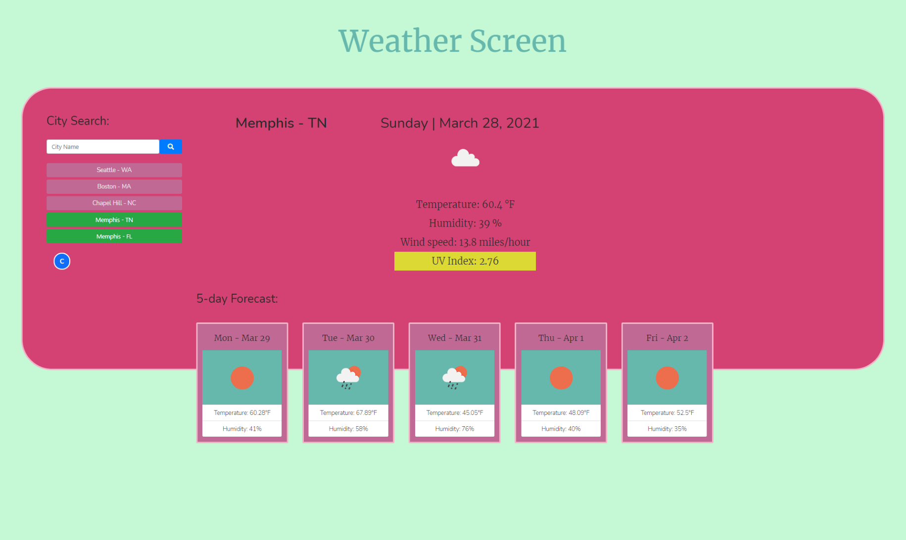

 

## **weather screen** 
 

[https://aranata.github.io/weather-screen/](https://aranata.github.io/weather-screen/) 
 
 

## description

***
 This is an application that allows users to follow the weather forecast of different locations they pick. It is featuring a dynamically updated HTML and CSS powered by JavaScript code - and retrieves the weather data from OpenWeather API. 
 Third-party APIs allow developers to access their data and functionality by making requests with specific parameters to a URL. Developers are often tasked with retrieving data from another application's API and using it in the context of their own.
 
 

## acceptance criteria

***

The codebase achieves the following criteria: 

* GIVEN a weather dashboard with form inputs: 
* WHEN I search for a city; THEN I am presented with current and future conditions for that city and that city is added to the search history 
* WHEN I view current weather conditions for that city; THEN I am presented with the city name, the date, an icon representation of weather conditions, the temperature, the humidity, the wind speed, and the UV index 
* WHEN I view the UV index; THEN I am presented with a color that indicates whether the conditions are favorable, moderate, or severe 
* WHEN I view future weather conditions for that city; THEN I am presented with a 5-day forecast that displays the date, an icon representation of weather conditions, the temperature, and the humidity 
* WHEN I click on a city in the search history; THEN I am again presented with current and future conditions for that city 

 
 

## usage

***

A full view of the page  
 

 
 

A short video that shows how the UI works. 
 

 
 

## some valuable references

***

These notes and links are listing some valuable references among others that I used doing this project: 
 

[https://jquery.com/](https://jquery.com/)

[https://getbootstrap.com/](https://getbootstrap.com/)

[https://momentjs.com/docs/#/displaying/](https://momentjs.com/docs/#/displaying/)

[https://developer.mozilla.org/](https://developer.mozilla.org/)

[https://favicon.io/favicon-generator/](https://favicon.io/favicon-generator/)

[https://fonts.google.com/?preview.text_type=custom](https://fonts.google.com/?preview.text_type=custom)

[https://fontawesome.com/](https://fontawesome.com/)

[https://shields.io/category/dependencies/](https://shields.io/category/dependencies/)

[https://www.screencastify.com/](https://www.screencastify.com/)

 
 

## credits

***

Stephen Woosley - Bootcamp Instructor 
Patrick Haberern - Bootcamp TA 
Tim Nagorski - Bootcamp TA 
Sean Walmer - Bootcamp TA 
Alexis San Javier - Bootcamp Tutor 
 
 

## license

***

This is an assigment done under a bootcamp program, it is public but please contact the publisher before you use or 
change any content. 
ghibli.github@gmail.com
 
 

## badges

***

 
 

---
